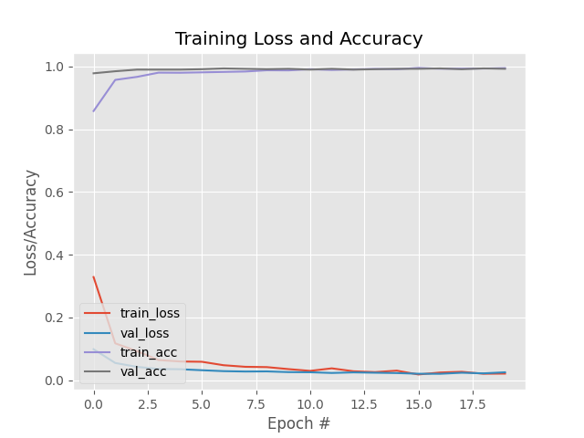

# Face Mask Detection Using MobileNetV2

## Project Overview

- This project involves the development of a deep learning model to detect whether a person is wearing a face mask or not in an image. 
Leveraging the MobileNetV2 architecture, the model is fine-tuned for binary classification (with mask or without mask) using transfer 
learning. The project is essential in the context of the COVID-19 pandemic, where face masks became a critical measure for public health.

## Project Structure

- Data Augmentation: Utilized ImageDataGenerator to perform data augmentation, including random rotations, zooms, shifts, shearing, and horizontal flipping.
- Transfer Learning: Employed MobileNetV2 pre-trained on ImageNet as the base model, with additional layers on top for the specific task.
- Binary Classification: The model predicts whether a person in the image is wearing a mask or not.
- Real-Time Implementation: Developed a real-time face mask detection system using the trained model and OpenCV.
- Training:
The model was compiled with the Adam optimizer, using a binary cross-entropy loss function.
Training was conducted over 20 epochs with a batch size of 32.
- Visualization: Training loss and accuracy plots are generated to visualize the performance of the model.

## Results

- The model achieves exceptional performance, with both training and validation loss nearing zero and accuracy approaching one. This indicates effective error minimization and high classification accuracy, demonstrating the model’s strong capability to generalize well on new data. The results underscore the model's robustness and suitability for accurate face mask detection in real-world scenarios.

## Conclusion

- This project showcases the successful application of deep learning techniques for real-world problems, leveraging the power of 
pre-trained models and transfer learning. The face mask detection model, along with its real-time implementation, can be further 
improved and integrated into various systems for public health monitoring and safety compliance.

## Documentation

[Project Report](./FaceMask%20(1)-converted.pdf)
